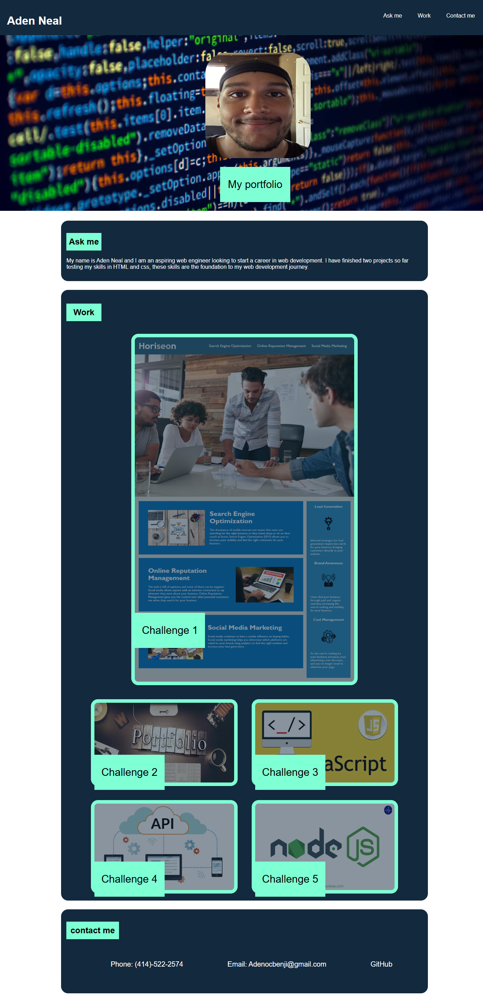

# Challenge2

## Purpose and Description

the purpose of thiswebsite is to show my portfolio to future employers

This website covers a breif description of my status as a developer and what ive completed. Next the website shows two of my projects and three future projects with a picture of each. Each of my project cards have a hover effect showing what ive learned in this unit. The last thing on this website is the footer which contains my contact information with functinal links.

## Tech stack

* HTML was used to create the skeleton of the website and provide information like links and images.
* Advanced CSS was used to format and style the website with colors while using flexbox.

## Design

## Link to finished website
https://adenman.github.io/Challenge2-Aden-Neal/
